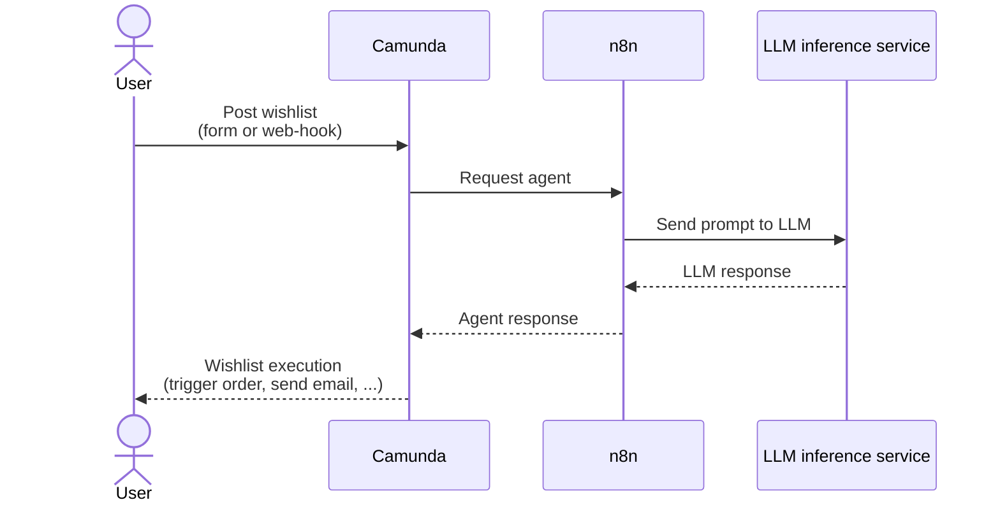

# Combine camunda and n8n

This is an example of how to integrate the AI-focused workflow-engine [n8n](https://n8n.io/) in the enterprise-focus mature [camunda](https://camunda.com/).



## Step 1: Setup Infrastructure

Startup your docker environment, e.g. [Docker-Desktop](https://www.docker.com/products/docker-desktop/) (you need to have a license), [colima](https://github.com/abiosoft/colima), [rancher](https://rancherdesktop.io/), [podman](https://podman-desktop.io/), or other ...

Verify docker-readiness with

    docker info

### Docker Setup Camunda

Start camunda8 with docker compose

    cd docker-camunda
    docker compose -f docker-compose-full.yaml up -d

Check if [operate](http://localhost:8088/operate), [tasklist](http://localhost:8088/tasklist), [web-modeler](http://localhost:8070/), and [mailpit](http://localhost:8075/) are available. Instead of the web-modeler you can also use the [Desktop Modeler](https://camunda.com/download/modeler/). On first start-up, this may take up to 5min until the elastic search DB is ready.

For experimental self-managed environment, you can use username `demo` with password `demo`.

(You find details of camunda 8 self-managed [here](https://docs.camunda.io/docs/self-managed/quickstart/developer-quickstart/docker-compose/); some notes on licensing you find in this [blog](https://camunda.com/blog/2024/04/licensing-update-camunda-8-self-managed/))

### Docker Setup n8n

Start n8n with docker compose

    cd docker-n8n
    docker compose up -d

and [n8n](http://localhost:5678).

### Local (L)LM inference (optional)

Start your locally running LLM-inference with OpenAI-compatible API. e.g. [LM studio](https://lmstudio.ai/), [ollama](https://ollama.com/), or [lite llm](https://www.litellm.ai/).

Load a model, e.g. [magistral-small (lm studio)](https://lmstudio.ai/models/mistralai/magistral-small-2509), [phi4 (ollama)](https://ollama.com/library/phi4), ..

## Step 2: Load your workflows+

#### Camunda

1. Open [web-modeler](http://localhost:8070/) (with "demo").
1. Create a new project, name it "Wishlist answering AI".
1. Click on "Create new", "Upload files". Upload all files from [camunda](./camunda/).
1. Open every file in web-modeler (start with `decision*` and last `wishlist_process`) and deploy those.

* Optional: Resolve the red cross icons in `wishlist_process.bpmn` on `StartEvent`, `ServiceTask`, and `MessageIntermediateCatchEvent` by:
    1. Click on one of these
    1. Click on "Change element"
    1. Click on "Browse Marketplace for more connectors"
    1. Select type "inbound", search for [Webhook Connector](https://marketplace.camunda.com/en-US/apps/418745/webhook-connector) by Camunda, and "Download to project".
    1. Select type "outbound", search for [REST Connector](https://marketplace.camunda.com/en-US/apps/415933/rest-connector) by Camunda, and "Download to project".
    * Hint: The red icons vanish if you exit and reenter the process diagram.

#### n8n

While starting [n8n](http://localhost:5678) for the first time, you are asked for your name and email. You may answer truthfully if you want to receive material. For experimentation purposes, you can also answer with valid but incorrect values.

1. Open n8n
1. Click on "Start from scratch"
1. Click on the `...` icon and click "Import from File..."
1. Select [wishlistWorkflow](./n8n/wishlistWorkflow.json) for upload.

Then you need to configure your credentials of the LM inference service.

1. Double-click on node "Local LM inference"
1. Click on "Credential to connect with" and select "+ Create new credential"
    1. Set `API key` to anything.
    1. Set `Base URL` to `http://host.docker.internal:1234/v1`.
    1. Click on "Save" and close the credential dialog.
1. Set the `Model` properly and close the node configuration dialog.
1. Now activate the workflow (switch the toggle to "active").

## Step 3: Use your setup

### Via camunda form

1. Open [processes view](http://localhost:8088/tasklist/processes) in [tasklist](http://localhost:8088/tasklist).
2. Start the "wishlist process" and fill the form.
3. ... wait ...
4. Inspect your tasks in [tasklist](http://localhost:8088/tasklist) and approve the wishlist. Alternatively inpsect the progression and completion of your processes instance in [operate](http://localhost:8088/operate).

### Via camunda-connector

1. Start process
    ```shell
    curl -v -H "Content-Type: application/json" http://localhost:8086/inbound/wishlist -d '{"from": "John Dow", "wishlist": "nerfgun"}'
    ```
2. ... wait ... (while waiting, take a look into [operate](http://localhost:8088/operate), [n8n](http://localhost:5678/), and your LLM-service)
3. Inspect your tasks in [tasklist](http://localhost:8088/tasklist) and approve the wishlist.

### Without camuna (only n8n)

1. Start process
    ```shell
    curl -v -H "Content-Type: application/json" http://localhost:5678/webhook/wishlist -d '{"wishlistFrom": "John Doe", "wishlistContent": "nerfgun" }'
    ````
2. ... wait ... (while waiting, take a look into [n8n](http://localhost:5678/), and your LLM-service)
3. Check your [n8n workflow](http://localhost:5678/)'s executions.

## Step: Experiment

- Use "worldpeace" as your wish. In most cases (keep in mind: LLMs are not 100% determinstic) you will be asked for an approval. Check your [tasklist](http://localhost:8088/tasklist).

# Notes

- With **docker networks** you need to use `host.docker.internal` to connect to the docker host machine `localhost`.
